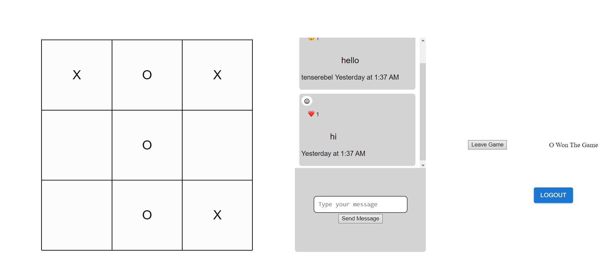

# Multiplayer-Tic-Tac-Toe

A multiplayer game of tic tac toe using getstream api and made using ReactJS for frontend and NodeJS for the backend.
Learned about websockets using getstream and improved UI using materialUI. The application uses getstream functionality such as Channel and Chat. 

# Youtube Link
[Link](https://youtu.be/Iw1YmBoOYb4)

# Images

 
